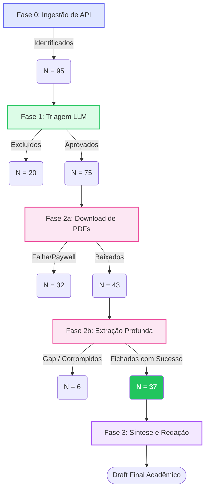

# Revisão DT: Sumário Executivo e Log PRISMA

Este documento consolida o estado final da Revisão Integrativa, refletindo o diagrama de fluxo metodológico e o rastreamento (auditabilidade) de todas as fases.

## 1. Fluxograma PRISMA Atualizado

## 2. N Final do Estudo
O *corpus* analítico aprovado para a Síntese Temática é composto por **37 estudos primários**.
Estes artigos passaram por 4 etapas rigorosas de filtros e validações, garantindo alinhamento total aos construtos definidos na ontologia da pesquisa.

## 3. Logs de Auditoria e Transparência
Todos os metadados de exclusões e inferências podem ser auditados no diretório `.agent/data_storage/saida/`:
- **PRISMA_LOG_MASTER.csv**: Detalhamento de cada inclusão/exclusão (Fase 1).
- **DOWNLOAD_MAP.csv**: Rastreamento de origem de cada arquivo físico PDF/XML obtido (Fase 2a).
- **EXTRACTION_LOG.csv**: Log de execução do VLM/LLM sobre os full-texts (Fase 2b).

## 4. Query de Busca Oficial
*(Carregada diretamente do `criteria_config.yaml` original)*
- A busca focou em bases que abordassem Metodologias Ativas e Design Thinking.
