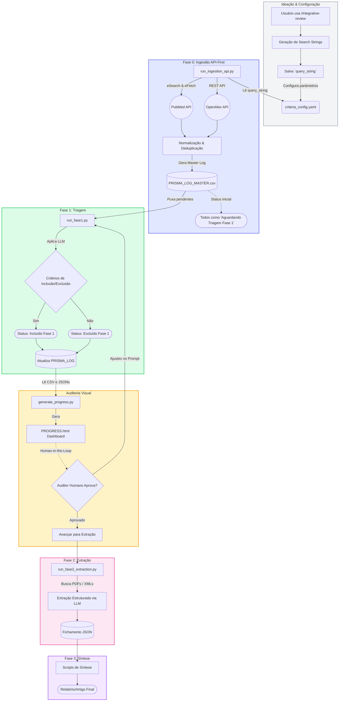

# Especificação e Organograma Visual do Pipeline (Revisão DT) - Modo API-First

Este documento mapeia o fluxo real atualizado do sistema. A grande mudança arquitetural é a eliminação do trabalho braçal de baixar CSVs: o sistema agora opera via APIs conectadas diretamente às bases científicas.

---

## 1. Organograma Metodológico (Macro Fluxo Real)

Abaixo está o diagrama exato da jornada de um artigo científico no nosso sistema, focado na ingestão automatizada via API.

---

## 2. Detalhamento Técnico das Fases (A Jornada do Dado)

### Ideação & Configuração (O Fim do Download Manual)
<!-- BEGIN FASE_IDEACAO -->
Você definiu a `query_string` no arquivo `criteria_config.yaml`.
Não há mais a necessidade de acessar os sites, exportar CSVs e colocá-los na pasta `exportacao`. O sistema agora é autônomo.
<!-- END FASE_IDEACAO -->

### Fase 0: Ingestão API-First (O Nascimento dos Artigos)
<!-- BEGIN FASE0 -->
- **Script Alvo:** `scripts/review_pipeline/run_ingestion_api.py`
- **O que faz:** Ele lê a `query_string` do seu YAML e faz requisições diretas via rede para as APIs do **PubMed** e **OpenAlex**.
- **Processamento:** Ele padroniza as colunas e remove artigos duplicados usando o DOI dinamicamente.
- **Saída:** Ele cria e popula diretamente o arquivo mestre `.agent/data_storage/saida/PRISMA_LOG_MASTER.csv`. 
- **Conceito Chave:** Todo artigo recém-baixado da API entra com o status `"Aguardando Triagem Fase 1"`.
<!-- END FASE0 -->

### Fase 1: Triagem (Screening via trAIce)
<!-- BEGIN FASE1 -->
- **Script Alvo:** `scripts/review_pipeline/run_fase1.py`
- **O que faz:** Lê o arquivo mestre, filtra quem está "Aguardando", envia para o Ollama local aplicar os critérios do YAML, gera o Raciocínio (Reasoning) com CoT e atualiza o status de volta no CSV para Incluído ou Excluído.
<!-- END FASE1 -->

### Fase 1.5: Auditoria & HITL (Human-in-the-Loop)
<!-- BEGIN FASE_AUDITORIA -->
- **Script Alvo:** `scripts/generate_progress.py`
- **O que faz:** Renderiza os resultados da triagem em um Dashboard HTML interativo. Permite auditar exatamente as justificativas da IA para refinar os prompts ou critérios antes da fase pesada de leitura de PDFs.
<!-- END FASE_AUDITORIA -->

### Fase 2: Fichamento / Extração 
<!-- BEGIN FASE2 -->
- **Script Alvo:** `scripts/review_pipeline/run_fase2_extraction.py`
- **O que faz:** Atua exclusivamente sobre os artigos aprovados na Fase 1. Lê o PDF ou XML completo e solicita ao LLM a extração de dados estruturados em JSON respondendo a perguntas metodológicas específicas.
<!-- END FASE2 -->

### Fase 3: Síntese (Finalização)
<!-- BEGIN FASE3 -->
- Consome todos os dados da Fase 2 para gerar os resumos finais, tabelas analíticas e os rascunhos do artigo científico final da revisão.
<!-- END FASE3 -->
